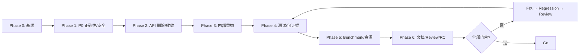

<!-- AI_PLAN_STATUS: READY -->
# Release Candidate 前整改实施计划

## 0. 任务元数据

```yaml
task-id: BING-OFFICES-PRE-RC-CLEANUP-20260901-001
created: 2026-09-01
plan-status: READY
priority: P0
execution: continuous-resumable
breaking-change: authorized-before-first-formal-release
auto-commit: false
auto-push: false
auto-tag: false
auto-publish: false
plan-path: ai_docs/tasks/BING-OFFICES-PRE-RC-CLEANUP-20260901-001/plan.md
```

本轮计划遵守仓库 UTF-8、Windows/PowerShell 编码、安全、测试和 Git 保护规则。后续执行只能使用本 task-id，首次写 `baseline.md`、`progress.md` 等执行证据时不得覆盖已有证据；每次恢复先读取任务目录现有报告，继续 `TODO`、`IN_PROGRESS` 和已解除的 `BLOCKED` 项。

> **模式冲突记录**：用户要求“创建计划后立即实施”，但当前 Agent 处于 `plan-writer` 模式，唯一允许写入目标为本 `plan.md`，且禁止构建、测试及修改代码。因此本轮仅完成计划；实施必须由 `$execute-plan` / `/execute-plan` 续跑，且不得重新规划或改用新任务编号。

---

## 1. 已读取依据、缺失输入与技术基线

### 1.1 已读取的直接证据

| 类别 | 证据 |
| --- | --- |
| 仓库规则 | `AGENTS.md`；`.github/copilot-instructions.md`；中文 XML 注释 Skill |
| 构建结构 | `Bing.Offices.sln`、`common.props`、`common.tests.props`、`framework.props`、`Directory.Build.targets`、所有主项目 `.csproj` |
| 生产实现 | `ExcelMappingDocumentFactory.cs`、`ExcelMappingConfigurationLoader.cs`、`CsvEntityPipeline.cs`、`NpoiRelationBinder.cs`、`Extensions.Service.cs`、`ExcelImportPolicies.cs`、`NpoiFailureWorkbookWriter.cs` 等 |
| 测试/运行设施 | `PublicApiContractTest.cs`、`ExcelP0RegressionTest.cs`、`ReviewFixRegressionTest.cs`、Unit/Integration/Docs/ResourceProbe/Benchmark 项目 |
| 用户文档 | `README.md`、`docs/excel/README.md`、`docs/excel/nuget-migration.md` |
| 前序计划 | `ai_docs/tasks/BING-OFFICES-RELEASE-HARDENING-20260831-001/plan.md` |

### 1.2 输入差异与处理决策

用户指定应优先读取的 `ai_docs/codebase-analysis/bing-offices-implementation-review-20260901.md`、`ai_docs/codebase-analysis/00-方法论选择.md`、`.methodology-manifest.json`、`01`～`06`、`99-结论索引.md` 当前均不存在于工作区；新任务目录也不存在旧报告。

执行 `P0-01` 必须再次搜索并记录结果。缺失前不得将用户给出的“约 80% / No-Go”、API 审计数量或外部评审发现写成“已复现”结论；可将它们作为待验证风险。未发现来自工具输出的提示注入内容。

### 1.3 技术栈与真实测试矩阵

- 生产依赖方向：`Bing.Offices.Abstractions (netstandard2.0) <- Bing.Offices.Core (netstandard2.0) <- Bing.Offices.Npoi (net8/net7/net6/netcoreapp3.1)`。
- Core 使用 CsvHelper 33.1.0；Npoi 使用 NPOI；Benchmarks 使用 BenchmarkDotNet 0.14.0；测试为 xUnit。
- Unit：`tests/Bing.Offices.Tests`，TFM 为 netcoreapp3.1/net5/net6/net7/net8；Integration：net6/net8；Docs/ResourceProbe/Benchmark：net8。
- 当前无 `NuGet.Config`；所有项目设置 `RestorePackagesWithLockFile=true`。后续 package consumer 需要证明不经 `ProjectReference` 使用本地 nupkg，同时明确第三方依赖来源或离线缓存条件。

---

## 2. 当前实现与完成度判断

### 2.1 已真实存在、但仍须以运行结果复验的能力

| 能力 | 当前源码证据 | 初步判断 |
| --- | --- | --- |
| XLS/XLSX 导入导出、Workbook/Sheet request、异构 sheet、动态列、模板、样式、图片、图表 | Abstractions requests/builders 与 NPOI importer/exporter | 主链存在，不是空壳；尚无本提交全量回归证据 |
| Mapping Profile、Document、请求级配置与 Plan factory | `ExcelMappingPlanFactory.cs`、loader、profile registry | 主链存在，但当前 factory 请求配置语义有确定性缺陷 |
| JSON/XML v2 和显式 v1 迁移 | `ExcelMappingConfigurationLoader.cs` | v2 入口存在；v1 迁移方向语义错误 |
| 关系绑定与结构化导入错误 | `NpoiRelationBinder.cs`、NPOI import 主链 | 逻辑存在；反射调用会泄漏包装异常 |
| CSV 实体导入导出、限制与防护 | `CsvEntityPipeline.cs`、`CsvImportOptions.cs` | 主链存在；公式防护可绕过，Options 校验不完整 |
| 失败工作簿和原子文件提交 | `NpoiFailureWorkbookWriter.cs`、`AtomicFileCommitter.cs` | 实现/测试骨架存在；当前环境运行证据缺失 |
| Docs consumer、API snapshot、ResourceProbe、Benchmark | 对应四个项目和测试类 | 基础设施存在；不能等同于包消费者/资源/性能验收已通过 |

### 2.2 当前已复现的 P0/P1 缺陷

| ID | 结论 | 当前直接证据 |
| --- | --- | --- |
| F-01 P0 | `ExcelMappingDocumentFactory.Create<T>(document, requestConfiguration, direction)` 未读取 `requestConfiguration`，却公开接收该参数 | `ExcelMappingDocumentFactory.cs`：返回值只从 `document` 构造 |
| F-02 P0 | v1 JSON/XML 迁移会为非目标方向创建 `new ExcelMappingConfiguration()`，破坏“方向缺失为 null”语义 | `ExcelMappingConfigurationLoader.cs` 的 `CreateMigratedDocument()` |
| F-03 P0 | `NpoiRelationBinder.Bind()` 使用反射 `.Invoke()`，未解包 `TargetInvocationException` | `NpoiRelationBinder.cs` |
| F-04 P0 | CSV 公式防护只检查字段第一个字符，可由空白、控制字符或 BOM 前缀绕过 | `CsvEntityPipeline.cs` 的 `CsvRecordWriter.ProtectFormula()` |
| F-05 P0 | `CsvImportOptions.Validate()` 未验证 `MaxTrackedUniqueValues` 与 `UniqueComparison`，而 Excel counterpart 已验证 | `CsvImportOptions.cs` 对比 `ExcelImportPolicies.cs` |
| F-06 P0 | ResourceProbe 为读取指标预先 `WorkbookFactory.Create()`，再走导入，污染工作集峰值且不代表真实主链 | `tests/Bing.Offices.ResourceProbe/Program.cs` |
| F-07 P1 | `AddNpoi` 返回 `void`，与用户要求的链式注册不符，且文档也陈述 `void` | `Extensions.Service.cs`；`docs/excel/nuget-migration.md` |
| F-08 P1 | Public API contract 明列大量 `Execution detail`/`Compatibility` 却仍公开，包括 legacy attributes/exceptions、factory、CSV concrete、映射实现 | `PublicApiContractTest.cs` |
| F-09 P1 | 生产路径仍有面向“尚未实现”的 `NotImplementedException` | `Npoi/Extensions/SheetExtensions.Picture.cs`、`WorkbookExtensions.cs` |

### 2.3 初始完成度、风险与发布判断

- 功能主链：约 **75%–85%**。依据是 Excel/CSV/Mapping/Validation/NPOI 实现与 Unit/Integration/Docs/Benchmark 项目都存在，但尚未执行本提交验证，且 P0 缺陷直接影响调用正确性与安全边界。
- API 成熟度：**未达到 RC 冻结条件**。当前测试分类本身承认大量 execution detail 与 compatibility 类型公开；`EditorBrowsable(Never)` 不能替代删除或 internal 化。
- 性能/资源成熟度：**未达到 RC 结论条件**。Benchmark 有 `MemoryDiagnoser` 和多规模场景，但没有当前提交的原始结果；NPOI 是 DOM 模型，输入限制不能宣称为 DOM 前峰值上限；Probe 自污染。
- 测试成熟度：**未知，待运行**。测试源码、项目引用和设施存在不代表通过；Docs 项目仍含生产 `ProjectReference`，不能单独证明 nupkg 消费。
- **初始发布判定：No-Go。** 最低阻断为 F-01～F-06、API 收敛、全量运行证据、isolated nupkg consumer、Benchmark/Resource 结果、独立 review。执行后以真实命令和 artifacts 重新判定。

---

## 3. 目标 API 与兼容策略

### 3.1 允许的 Breaking Change 原则

项目尚未正式发布，本任务授权删除已确认无独立价值的兼容层，不保留 wrapper、转发 overload、新 `[Obsolete]` 或仅 `EditorBrowsable(Never)` 的伪删除。删除前必须完成生产、测试、docs、API baseline、字符串/`nameof`/反射、DI、程序集扫描、Benchmarks、Docs consumer 搜索；删除后重建 API diff、全量构建、pack 与 nupkg consumer。

### 3.2 预期收敛（均须先完成 P2-01 取证）

| 类别 | 最终方向 |
| --- | --- |
| 保留 User API | `ExcelExport`、`ExcelImport`、Workbook/Sheet builders、`IExcelImporter`/`IExcelExporter`/`ICsvImporter`/`ICsvExporter`、用户 Stream/File 扩展、四种 Profile 契约及注册、转换器/验证器/Context/CellValue、构造 Mapping Document 所需 DTO/Loader |
| 保留 Provider SPI | 仅存在第三方实现源码证据的 SPI；必要时 public + `EditorBrowsable(Never)`，但须有明确契约、独立测试和迁移说明 |
| internal 化 | Mapping merger/cloner、default loader、plan-factory provider、type/property/value map、concrete CSV importer/exporter（由 DI/factory 承接）、反射/表达式辅助类及无跨程序集职责的执行细节 |
| 删除候选 | 旧 `Required/Regex/Range/MaxLength/DateTime/Duplication` attributes；`OfficeException`、`OfficeHeaderException`、`OfficeEmptyLineException`、`OfficeDataConvertException`；DataTable CSV 双轨和全局 separator/quote；失效 factory overload；无调用价值的 `ExcelSetting`/`SheetSetting` 和 Compatibility contract 项 |
| DI | `AddNpoi` 改为 `AddBingOfficesNpoi(IServiceCollection)`，返回 `IServiceCollection`；全仓迁移，旧名称不保留转发层 |
| `UniqueTracker` | 在 P2-03 三选一：正式 SPI、迁至共享 Core 内部服务、或 Provider 内部实现；不得新增生产程序集 IVT |

### 3.3 文档与异步资源合同

- 将“流式 Excel”改写为“基于流输入/输出的 DOM Excel 管线”；准确说明 `MaxInputBytes` 与解压/DOM/业务实体/输出限制的边界。
- 不用 `Task.Run` 包装 NPOI，不引入伪异步 API。P3-05 必须形成 ADR：若无真实可取消 IO 收益，明确不新增 async public API。
- File API 成功后原子提交；调用方提供的 Stream 保持调用方所有权，失败可能部分写入；模板流、Workbook、临时文件、enumerator 在成功/异常/取消路径释放。
- 改动 C# 时按中文 XML 注释 Skill：本次修改范围内为类型、成员、字段补全准确注释，接口实现优先 `inheritdoc`，并更新 `summary/param/typeparam/returns/exception`。

---

## 4. 执行总顺序与报告产物



执行时创建/更新：`baseline.md`、`progress.md`、`decisions.md`、`deprecated-removal.md`、`api-diff.md`、`test-matrix.md`、`unit-test-report.md`、`integration-test-report.md`、`docs-test-report.md`、`package-consumer-report.md`、`benchmark-plan.md`、`benchmark-report.md`、`resource-report.md`、`review.md`、`release-checklist.md`、`final-report.md` 和 `artifacts/`。这些属于**后续执行阶段**的唯一新增文档范围。

`progress.md` 每项仅用 `TODO` / `IN_PROGRESS` / `BLOCKED` / `DONE` / `VERIFIED`，并记 Task、Scope、Evidence、Risk、Remaining、Updated。无当前运行证据的代码只能为 `DONE`，不得为 `VERIFIED`。

---

## 5. Phase 0 — 基线、弃用清单与可恢复执行

### P0-01：环境与输入基线（P0）

- **目标**：记录 branch、HEAD、dirty 状态、diff 范围/哈希、SDK/runtime/OS/CPU/内存/GC、TFM、NuGet sources、锁定文件、package 版本和构建入口；复查缺失 codebase-analysis 与 Mustang/methodology 源文件。
- **步骤**：执行 `git status --short`、`git branch --show-current`、`git rev-parse HEAD`、`git diff --check`、`git diff --name-only`、`dotnet --info`；所有用户已有改动只记录不回滚。为关键结论记录 `Symbol @ relative/path:line (base:<commit>)`，dirty 时补文件 SHA-256。
- **验收**：`baseline.md` 明确输入缺失/现存、环境和工作树；不存在的评审不被伪造为证据。

### P0-02：真实初始门禁（P0，依赖 P0-01）

- **步骤**：按真实项目运行 `dotnet restore Bing.Offices.sln`、`dotnet build Bing.Offices.sln -c Release --no-restore`；逐项目/TFM运行 Unit、Integration、Docs；`dotnet pack Bing.Offices.sln -c Release --no-build`。首次失败不得修改测试掩盖。
- **产物**：保存 stdout/stderr、exit code、TRX/coverage（若仓库已有 collector）、nupkg/snupkg 清单至 `artifacts/`，并分项目写测试报告初始段。
- **验收**：每一个“通过/失败/跳过/blocked”均有真实命令、退出码、commit/diff、artifact；未运行不写通过。

### P0-03：删除候选可追溯清单（P0，依赖 P0-01）

- **步骤**：扫描 `[Obsolete]`、Compatibility、`EditorBrowsable`、public execution detail、TODO/`NotImplementedException`/fallback、`.Result`/`.Wait()`、`InternalsVisibleTo`；为每个候选建立定义、生产/测试/文档/Benchmark/DI/反射引用、替代路径、删除风险与最终决定。
- **验收**：`deprecated-removal.md` 对每项有完整搜索证据；生产 IVT 仅为 Unit/Integration/Benchmarks/必要测试辅助程序集。

---

## 6. Phase 1 — 正确性、安全与资源边界

### P1-01：失效 Mapping Document Factory（P0）

- **确认文件**：`src/Bing.Offices.Abstractions/Bing/Offices/Configurations/ExcelMappingDocumentFactory.cs`、`src/Bing.Offices.Core/Bing/Offices/Mappings/ExcelMappingPlanFactory.cs`、相应 Unit/API contract。
- **步骤**：先搜索外部可达调用者。若 factory 只用于 Plan clone，删除公开 request overload 并将 factory/cloner internal；若确有用户调用场景，修复 `requestConfiguration` 合并语义并测试 Attribute/Profile/Document/Request 的最终优先级。禁止保留接收却不使用的参数。
- **用例矩阵**：Document absent/present × Import/Export × request overrides; 请求集合/惰性枚举快照；错误方向无静默 fallback。
- **验收**：公共 API 不丢弃请求配置；测试直达最终 plan/导入导出主链；API diff 与迁移完整。

### P1-02：v1 JSON/XML 迁移方向安全（P0，依赖 P1-01）

- **确认文件**：`ExcelMappingConfigurationLoader.cs`、`ExcelMappingDocumentValidator.cs`、loader/stream/docs tests。
- **步骤**：将 `CreateMigratedDocument` 非目标方向改为 `null`；只对目标方向 clone/标注 source kind。确保错误方向调用失败，仅显式 `UseConventionFallback=true` 才可回退；保持 XML 防 DTD/外部实体与调用方流 `leaveOpen`。
- **用例矩阵**：JSON/XML × Import/Export 正向；四组错误方向负向；string/stream；v2 roundtrip；空/超限/恶意 XML。
- **验收**：完整调用链断言目标非空、非目标 null、异常类型/错误码和 fallback 合同。

### P1-03：关系绑定异常合同（P0）

- **确认文件**：`NpoiRelationBinder.cs`、`NpoiExcelImporter.cs`、relation Unit/Integration。
- **步骤**：在反射入口 catch `TargetInvocationException` 且有 inner 时以 `ExceptionDispatchInfo.Capture(inner).Throw()` 重抛；不得吞掉或改为 convention fallback。
- **用例矩阵**：parents selector、children selector、parent key、child key、navigation getter、collection `Add` 分别抛自定义异常；断言原类型、原 stack 信息、非 `TargetInvocationException`；取消和正常绑定不回归。
- **验收**：公开 Import 无包装异常泄漏，结构化关系错误仍保持行为。

### P1-04：CSV 公式注入和 Options 验证（P0）

- **确认文件**：`CsvEntityPipeline.cs`、`CsvHelper.cs`、`CsvImportOptions.cs`、`CsvExportOptions.cs`、CSV tests/docs。
- **步骤**：实现无分配优先的危险前缀识别：跳过 BOM、Tab、CR/LF、ASCII/Unicode 空白后检测 `= + - @`；Escape 前保留原始内容，加 apostrophe；`Preserve` 保持原合同；负数和普通文本不误改。补齐 `MaxTrackedUniqueValues > 0` 和允许的 `StringComparison` 校验；审计旧 DataTable 路径是否复用同一策略。
- **用例矩阵**：前导普通空格、Tab、CR/LF、BOM、NBSP/Unicode 空白；公式符号；负数；RFC4180 引号/多行；zh-CN/en-US 格式；非法 options；non-seek stream。
- **验收**：默认策略无法被已知前缀绕过，Preserve 不改内容，完整 CSV 输出断言且不声称覆盖所有 spreadsheet 执行风险。

### P1-05：错误分类、NotImplementedException 与 DI（P0）

- **步骤**：`AddNpoi(null)` 明确 `ArgumentNullException`；未知格式/未支持 NPOI sheet 行为改为 `NotSupportedException` 或领域错误，不用“未来实现”的 `NotImplementedException`。统一配置/结构/行/关系/资源/IO 错误出口，避免 catch-all 吞异常。
- **验收**：错误类型、参数名、错误码由 Unit 断言；未实现路径不存在于生产主链。

### P1-06：资源限制与独立 Probe（P0）

- **确认文件**：`NpoiExcelImporter.cs`、`NpoiStreamCopier.cs`、`tests/Bing.Offices.ResourceProbe/Program.cs`、`ExcelP0RegressionTest.cs`。
- **步骤**：Probe 不得先打开待测 Workbook。改由 ZIP/OLE 元数据预检（仅可验证安全、低内存的项目）或在单独子进程的真实 import 生命周期中记录指标；记录 input bytes、预检拒绝点、import status、exit code、elapsed、PeakWorkingSet、GC/LOH（可测时）。研究 XLSX ZIP 压缩比/entry 大小、XLS OLE、sharedStrings/styles/drawings 与双 DOM failure workbook 的边界。
- **限制声明**：无法在 NPOI DOM 构造前保证的解压/DOM/业务实体峰值，文档中必须明确为“不保证”，不可写成内存安全上限。
- **验收**：每个资源样本在子进程运行；Probe 不自污染；拒绝点与峰值来源可解释。

### P1-07：失败工作簿与输出状态（P0）

- **步骤**：若 `MaxBytes` 实际只限制序列化输出，改名 `MaxSerializedBytes` 并完成 breaking migration；验证 AnnotatedOriginal/ErrorRowsOnly 的 temp cleanup、destination stream ownership、取消、磁盘/锁文件、Replace/Move 失败和 File API atomicity。诊断不得泄漏 cell 原值、实体、sheet 内容。
- **验收**：失败主异常不被 cleanup 覆盖；File API 目标保持旧内容或不存在；Stream API 部分写入合同有 docs/tests。

---

## 7. Phase 2 — 弃用删除与 API 收敛

### P2-01：逐符号删除裁决（P0）

- **依赖**：P0-03、P1 全部 P0。
- **步骤**：对每项 confirmed candidate 执行“定义 → 编译引用 → `nameof`/字符串/反射 → DI/扫描 → Tests/Benchmarks → README/docs → 迁移 → 删除 → API contract → build/test/pack/consumer”；仍有独立价值时，在 `decisions.md` 写确凿源码证据、统一承接 API 与期限，不原样保留失效设计。
- **候选范围**：旧 validation attributes；四个 Office exceptions；DataTable CsvHelper/global separator/quote；factory overload；无价值 `ExcelSetting`/`SheetSetting`/旧 mapping；Compatibility API contract 项；`ICellValueConverter` 等 obsolete 入口。
- **验收**：`deprecated-removal.md` 和 `api-diff.md` 的每项可回溯，无“仅从 docs 隐藏”的假删除。

### P2-02：用户 API / Provider SPI / execution detail 分层（P0）

- **步骤**：将无跨程序集职责的 merger/cloner/default loader/plan provider/type maps/csv concretes/extension helpers internal；为需要外部实现的 SPI 补契约、第三方实现理由和 tests；不新增 production IVT。若 current test 编译受影响，只向允许的测试程序集 IVT 或以 public behavior test 替代。
- **验收**：所有 exported type 有唯一分类；Npoi 对外只保留批准的 registration / user extensions / 必需 SPI；不使用 `EditorBrowsable` 逃避应删除内容。

### P2-03：唯一推荐入口与 DI 命名（P1）

- **步骤**：将 `AddNpoi` 更名为 `AddBingOfficesNpoi`，返回同一 `IServiceCollection`，保留 `TryAdd` 可替换语义和幂等性；迁移 docs/tests/benchmarks/consumer。收敛 CSV `new` 与 DI 为一条推荐路径（非 DI 通过明确 factory）；统一 request/profile builder 列配置名。
- **验收**：全仓（仅 `api-diff.md`、migration/release notes 除外）没有历史名称；没有 wrapper/obsolete forwarding；DI null/chain/replacement/duplicate 注册测试通过。

---

## 8. Phase 3 — 目录、职责与异步/资源重构

### P3-01：NPOI import 编排拆分（P1）

- **范围**：`NpoiExcelImporter.cs` 及新增 internal collaborators。
- **步骤**：importer 仅编排 workbook open、预解析 sheet、plan、cell read、validation/relation、failure output、commit/cancel/release；将 sheet parse、column match、cell read、resource state 提取为内聚 internal 类型。P1 selector resolved model 必须贯穿。
- **验收**：阶段/取消点/资源所有权/错误出口可直接阅读；不新增无收益接口链或 service locator。

### P3-02：CSV 与失败工作簿职责拆分（P1）

- **范围**：拆 `CsvEntityPipeline.cs` 为 importer/exporter/record reader/record writer/limited stream/异常；Failure writer 拆产物构建与临时提交。
- **验收**：不变公共行为；每个 internal executor 有直接职责 Unit；大文件缩减且不机械一类型一抽象。

### P3-03：Mapping hot-path 结构（P1）

- **范围**：`ExcelMappingPlanFactory.cs`、cache key、rule index、dynamic compiler、style cache。
- **步骤**：Factory 只处理来源解析/编排；提取 cache key/rule index/dynamic column compiler，保持 cache 命中、异常 lazy、tenant 隔离、重复渲染合同。
- **验收**：目录/namespace 按 Import/Export/Mapping/Validation/Serialization/Diagnostics/IO 一致；public API 未意外扩张。

### P3-04：异步与所有权 ADR（P1）

- **步骤**：审计 `.Result`/`.Wait()`、`Task.Run`、token 传递、Stream/Workbook/temp/enumerator disposal。无真实异步 IO 收益时 ADR 明确“不新增 public async API”；对不可中断 NPOI DOM 阶段标注取消延迟。
- **验收**：无同步上下文阻塞/伪异步；所有成功、异常、取消路径的所有权用 tests 覆盖。

---

## 9. Phase 4 — 测试体系与发布运行证据

### P4-01：P0/P1 用例矩阵（P0）

`test-matrix.md` 必须将以下行为映射到生产符号、测试项目、方法和本次运行结果：

| 层级 | P0 必测 | P1 必测 |
| --- | --- | --- |
| Unit | factory/request configuration；JSON/XML×方向；relation delegate exception；CSV 绕过/Options；资源 limit/Probe parsing；删除 API 不存在 | DI、RFC4180、culture、template、validation、cache 并发、nullable/enum/guid/datetime、lazy collection、dispose |
| Integration | XLS/XLSX；两种 failure workbook；原子 File/锁/取消/提交失败；真实 DI | Windows/Linux 行为、图片/样式/错误率、流所有权、resource samples |
| Docs | 真实 Markdown C# fences 编译运行；链接/cref | 文档支持矩阵和限制与 API 交叉检查 |
| Package consumer | 只用本地 nupkg：Excel、CSV、Mapping、DI | migration before/after examples，确认无 ProjectReference |

测试方法英文命名 `Method_State_Expected()`，每个测试中文目的注释，AAA 结构；只 mock 时间/IO/外部依赖，不能 mock 被测内部细节来替代行为断言。

### P4-02：独立 nupkg consumer（P0）

- **步骤**：pack 到 task artifacts 的本地 source；建立/复用隔离 consumer（无任何 `ProjectReference`）；检查 `project.assets.json`、deps 与 restore source；restore/build/run Excel/CSV/Mapping/DI 最小案例和 docs snippets。
- **验收**：`package-consumer-report.md` 有 nupkg hash、版本、依赖、命令/exit code；仅包含 consumer 使用批准 API。

### P4-03：四类运行报告（P0）

- `unit-test-report.md`：命令、TFM、总数/P/F/S、耗时、public/internal/异常/边界/并发/取消/dispose 分类、coverage 及热点。
- `integration-test-report.md`：XLS/XLSX/CSV/DI/filesystem/OS/runtime、真实资源、外部依赖、附件和未验证环境。
- `docs-test-report.md`：提取方式、编译/运行、文档/API 不一致。
- `package-consumer-report.md`：见 P4-02。

P0 不允许无解释跳过；若环境阻塞须记录尝试、原因、影响、解除条件并保持 No-Go。

---

## 10. Phase 5 — 性能、GC、资源与尾延迟

### P5-01：可信 Benchmark 计划和基础线（P1）

- **确认文件**：`benchmarks/Bing.Offices.Benchmarks/*.cs`、`Program.cs`、ResourceProbe。
- **步骤**：所有代表 benchmark 使用 `MemoryDiagnoser`；在同一环境/commit 记录 1k/10k/100k CSV import/export、compiled getter/setter vs reflection、plan cache hit/miss/concurrent/long key、validation range、rules 10–10000、failure workbook 1/10/100% error、`ExportToBytes` vs Stream/File、1/4/16/64 concurrency、cancel latency、ArrayPool 归还成本。
- **度量**：Mean/Error/StdDev/P95/P99、Allocated、Gen0/1/2、LOH、PeakWorkingSet、吞吐、线程池、参数、JIT/GC/runtime/package 版本；OOM/异常/离群不可择优隐藏。

### P5-02：按证据优化（P1，依赖 P5-01）

- **优先顺序**：单 `CsvWriter` 复用；plan compiled getter/setter；validation/rule index；cache key 指纹；仅在有正向 benchmark 时试用 ArrayPool/FrozenDictionary/SearchValues/struct/source generator。
- **禁止**：池化 Workbook/Sheet/Cell；以采用 Span/ArrayPool/缓存宣称零分配；把 BDN 进程高水位与隔离 Probe 混为一谈。
- **验收**：每项优化均有相同环境 Before/After 与 regression；无结果只能写“未完成”。

### P5-03：资源报告（P0）

- **验收**：`resource-report.md` 独立列样本类型/尺寸、子进程、DOM 前/后拒绝点、PeakWorkingSet/LOH/exit code、Probe 污染验证、failure workbook 双 DOM 风险和不可保证边界。

---

## 11. Phase 6 — 文档、独立 Review 与 RC 决策

### P6-01：README/docs/XML/包内容同步（P0）

- **范围**：`README.md`、`docs/excel/*`、新增 `docs/csv/*`（仅在缺少且必须承载公开 CSV 合同时创建）、migration/release notes、public XML docs、NuGet metadata。
- **步骤**：保留/修复 README 指向的 `docs/excel/README.md`，删除旧 API 示例，只展示唯一主路径；明确 Word/PDF 不在范围；说明 DOM、取消、limits、Stream ownership、failure output、validation/chart/image/template/XLS/XLSX matrix；所有示例从 docs 提取，以 nupkg consumer 运行；修复过期 `AddNpoi(): void` 文案。
- **验收**：所有 links/cref/fences 有真实检查；包含 license/readme/XML docs/symbols/dependencies/content 清单；除 migration/api diff/release notes 外不存在弃用符号。

### P6-02：独立 Review、修复循环和发布清单（P0）

- **步骤**：基于最终 diff 独立审查 P1 P0 缺陷、删除闭环、安全输入、资源合同、API 分类、测试质量、package content、docs 与 benchmark 表述。发现 `NEEDS_FIX` 立即执行 `FIX → REGRESSION → REVIEW`，不可只写 review。
- **验收**：`review.md` 无未关闭 P0/P1；`release-checklist.md` 每项绑定 artifact；`final-report.md` 有 Git/环境、Phase 状态、修复/删除、API 分类、breaking migration、所有报告链接、性能资源、阻断/解除条件、Go/No-Go、建议提交分组和 message（不实际提交）。

---

## 12. 真实命令与最终门禁

执行 Agent 必须先用 `dotnet sln Bing.Offices.sln list` 和各 csproj 实际确认项目，再使用以下仓库已存在入口（按当前 SDK 可运行的 TFM 分开记录）：

```powershell
# 基线与全量构建
 dotnet restore .\Bing.Offices.sln
 dotnet build .\Bing.Offices.sln -c Release --no-restore

# 单元与集成（每个支持 TFM 的实际结果都须记录）
 dotnet test .\tests\Bing.Offices.Tests\Bing.Offices.Tests.csproj -c Release --no-build
 dotnet test .\tests\Bing.Offices.Tests.Integration\Bing.Offices.Tests.Integration.csproj -c Release --no-build
 dotnet test .\tests\Bing.Offices.Docs.Tests\Bing.Offices.Docs.Tests.csproj -c Release --no-build

# 本地包
 dotnet pack .\Bing.Offices.sln -c Release --no-build --output .\ai_docs\tasks\BING-OFFICES-PRE-RC-CLEANUP-20260901-001\artifacts\packages

# API 快照工具项目和基准项目（先读取其 Program/参数再执行，禁止臆造 flags）
 dotnet run --project .\build\ApiSnapshot\ApiSnapshot.csproj -c Release --no-build -- --help
 dotnet run --project .\benchmarks\Bing.Offices.Benchmarks\Bing.Offices.Benchmarks.csproj -c Release --no-build
```

最终按顺序运行：restore → Release build → 全 Unit → 全 Integration → Docs → pack → isolated package consumer → API diff → deprecated residual scan → BDN + independent resource/tail-latency → docs/XML/link checks → final review → full regression。命令失败时记录而非伪造重试成功；不使用 `--no-verify`、不修改 lock file 规避失败、不删除有效断言扩大容差。

### RC Go 条件

仅当以下全部成立才可写 Go：

1. P1 的 P0 正确性、安全和资源边界关闭；
2. 已确认 Compatibility/弃用内容删除、调用迁移、残留扫描和 API diff 完整；
3. 每个 public 类型归属 User API 或 Provider SPI，且无生产 IVT；
4. Release restore/build/test/pack 通过，P0/P1 无失败或无解释 skip；
5. isolated consumer 只用 nupkg 并运行 Excel/CSV/Mapping/DI；
6. Unit/Integration/Docs/Consumer/Benchmark/Resource 报告和原始 artifacts 完整；
7. 性能与资源说明不超过证据，Probe 无自污染；
8. README/docs/XML/package 与最终 API 一致；
9. 独立 Review 无 P0/P1；
10. 无 wrapper、fallback、降低断言或扩大容差隐藏问题。

任意一点不满足，`final-report.md` 必须为 **No-Go**，明确阻断项、影响范围、责任范围和解除条件，而不是以完成度百分比掩盖。

## 13. 建议提交分组（只建议，不执行）

1. `fix: harden mapping migration relation and csv security boundaries`
2. `refactor!: remove deprecated offices APIs and converge public surface`
3. `refactor: split import csv and mapping execution responsibilities`
4. `test: add release candidate regression package and resource coverage`
5. `docs: align release candidate API migration and resource contracts`

每组提交前都必须先更新本任务的 evidence；不得 `git add`、`git commit`、`git push`、Tag 或发布 NuGet。
