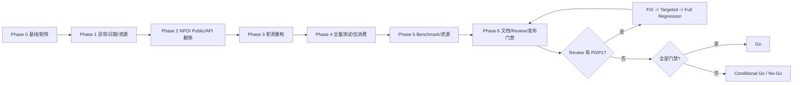

<!-- AI_PLAN_STATUS: READY -->
# Bing.Offices RC Hardening 实施计划

## 0. 任务元数据

```yaml
task-id: BING-OFFICES-RC-HARDENING-20260904-001
created: 2026-09-04
plan-status: READY
priority: P0
execution: continuous-resumable
breaking-change: major-version-authorized-by-user
current-agent-mode: plan-writer
auto-commit: false
auto-push: false
auto-tag: false
auto-publish: false
plan-path: ai_docs/tasks/BING-OFFICES-RC-HARDENING-20260904-001/plan.md
```

本计划是该 task-id 的首次初始化。后续执行必须持续使用 `BING-OFFICES-RC-HARDENING-20260904-001`，先读取任务目录已有状态，从 `TODO`、`IN_PROGRESS` 和已解除的 `BLOCKED` 项继续，不得换 task-id、覆盖历史证据或把仅完成代码的任务标记为 `VERIFIED`。

> **执行模式冲突**：用户要求“创建计划后立即继续实施”，但当前角色为 `plan-writer`，唯一允许写入目标是本 `plan.md`，禁止修改源码、测试、配置及执行实施命令。因此本轮只生成计划；完成后必须 Handoff 到 `/execute-plan BING-OFFICES-RC-HARDENING-20260904-001`、`/run-plan` 或 `$execute-plan`，由执行角色按本计划连续实施，不重新规划整体方案。

---

## 1. 输入、规则与缺失依据

### 1.1 已读取的事实依据

| 类别 | 已读取证据 |
| --- | --- |
| 仓库规则 | `AGENTS.md`、`.github/copilot-instructions.md`、`.github/prompts/create-plan.prompt.md` |
| 项目结构 | `Bing.Offices.sln`、`common.props`、`common.tests.props`、`framework.props`、三个生产 `.csproj`、测试和 Benchmark `.csproj` |
| 发布配置 | `asset/props/package.props`、README、NuGet migration 文档 |
| 最新独立评审 | `ai_docs/tasks/BING-OFFICES-PRE-RC-CLEANUP-20260901-001/review.md` |
| 上一任务证据 | API、Unit、Integration、PackageConsumer、Benchmark、Resource 报告 |
| 关键生产实现 | Mapping builders/factory、CSV pipeline、日期校验、`ExcelColumnPlan`、NPOI importer、Failure Workbook、Atomic File Commit、Workbook Validation、NPOI Extensions |
| 关键测试 | `PublicApiContractTest.cs`、日期/公式/扩展相关 Unit、Integration、Docs、ResourceProbe |
| 性能设施 | `MappingValidationBenchmarks.cs`、`StreamPipelineBenchmarks.cs`、`Program.cs`、ResourceProbe |

### 1.2 缺失或不能直接采信的输入

- 指定文件 `ai_docs/codebase-analysis/bing-offices-implementation-review-20260904.md` 当前不存在。
- 仓库未发现 Mustang、`.methodology-manifest.json` 或其它 methodology router；后续执行不能伪造 `framework-source` 路由结果，应在 `baseline.md` 记录“不存在”，直接采用源码调用链、扩展边界、质量风险和交付门禁分析。
- 仓库未发现 `NuGet.Config`；生产项目声明 `RestorePackagesWithLockFile=true`，但当前搜索未发现仓库级 `packages.lock.json`。执行阶段必须确认实际 restore 行为、生成位置和锁定策略，不能先宣称 strict lock restore 已满足。
- 当前 Planner 未执行新的构建或 Git 命令。最新可复核历史证据为上一任务独立评审：net6/net8 Unit 各 `384/384`、net8 Integration `15/15`、正式 API compare 通过；这些仅是新任务修改前的参考 baseline，执行阶段必须重新记录 branch、HEAD、dirty diff 并重跑基线。
- 用户提示“API Contract 测试 40 个重复键”与当前源码部分一致：`PublicApiContractTest.ApiTypeCategories` 中 Core 类型分类存在重复初始化项，静态初始化可能在测试发现/执行前抛出重复键异常；具体数量和当前运行表现必须由 Phase 0 基线实测确认，不能机械采用数字 40。

### 1.3 适用约束

- Windows + VS Code + PowerShell；所有文本按 UTF-8 读取和写入。
- 不回滚或覆盖当前 dirty worktree 中的用户改动；所有差异先归属，再最小化编辑。
- 不自动 commit、push、tag、publish、创建 PR；不执行 reset/clean。
- 参数错误保留标准参数异常；取消保留 `OperationCanceledException`；致命异常不得捕获转换。
- 可恢复行/单元格数据问题继续进入结构化 Import Error，不以异常替代正常数据校验流。
- 测试方法使用英文命名、中文目的注释、AAA；Integration 不依赖公网或生产资源。
- 当前允许合理 Major Breaking Change，但每项必须有成员级 API diff、迁移路径、PackageConsumer 和用户批准的正式 baseline；不得以更新 hash 隐藏未审查差异。

---

## 2. 当前实现与真实完成度

### 2.1 已真实接入的能力

| 能力 | 当前事实 | 判断 |
| --- | --- | --- |
| Excel/CSV Workbook Request 主链 | Abstractions request/builders、Core Mapping/CSV、NPOI importer/exporter 已存在并有上一任务全量测试证据 | 已实现，不是接口骨架 |
| Mapping 优先级与缓存 | Request/Document/Profile 合并、cache key、容量/租户隔离已进入 Factory，已有 Unit/Benchmark | 已实现，仍有公开 API 与职责收敛工作 |
| 结构化导入错误 | `ExcelImportError`、`CsvImportError` 覆盖可恢复数据错误 | 已实现，应与新的运行异常合同明确分层 |
| Failure Workbook 与原子文件提交 | 临时文件、取消、清理诊断和输出上限已实现 | 已实现，但异常类型与双 DOM 资源证据不足 |
| ResourceProbe | Excel child process 与 mapping/unique workload 已分离 | 局部有效，尚无生产 XLSX ZIP 拒绝器和完整资源门禁 |
| NPOI 扩展逻辑 | Cell/Row/Sheet/Workbook/Style/Font 方法均有真实实现和内部 Unit 使用 | 实现存在，但承载类为 `internal`，外部包消费者不可见 |
| API Snapshot | 当前正式 baseline 已绑定上一任务 API | 工具有效；本任务会有有意 API 扩张/收敛，必须重新审批 |

### 2.2 已确认的主要缺口

#### P0：公共错误合同缺失

- `src/` 未发现当前专属异常文件。
- Mapping loader/factory、CSV、NPOI import/export、Failure Workbook、Atomic File Commit 和 Provider 扩展大量公开运行失败仍抛 `InvalidOperationException`、`IOException`、`NotSupportedException` 或底层异常。
- 部分 catch-all 将用户 converter/validator/setter 异常压缩为普通结构化错误；需要区分可恢复输入错误与用户代码缺陷，并确保取消不被包装。
- Failure Workbook 已有 `DiagnosticSink`，但不是统一异常观察合同；观察器失败当前仅写 Trace，尚无跨 Excel/CSV/Mapping/IO 的一致行为。

#### P0：日期解析不确定且 Excel/CSV 不一致

- CSV 使用 `DateTime.Parse(value, culture)` / `DateTimeOffset.Parse(value, culture)`。
- NPOI `ExcelColumnPlan` 也直接使用 `DateTime.Parse`，校验器在未配置格式时使用 `DateTime.TryParse(context.Value, culture)`。
- 默认行为受请求 Culture 影响，不满足默认只确定性接受 ISO `yyyy-MM-dd` 的要求。
- 验证与转换分别解析，可能出现验证通过而转换行为不同。
- `ExcelCellValue` 能保存原始 `DateTime` 与 `ExcelCellKind.DateTime`，但未承载 1900/1904 date windowing 身份；Workbook Validation 仍混合 `FromOADate` 与文本解析。
- 当前没有完整 `DateTimeOffset`、1904 windowing、公式缓存日期、默认/显式格式负例矩阵。
- 生产目标包含 `netstandard2.0` 和 `netcoreapp3.1`，不能直接公开 `DateOnly`；本计划默认不公开 `DateOnly`，文档明确不支持，除非执行阶段先完成 TFM/API 变更审批。

#### P0：NPOI Provider 用户扩展被错误 internal 化

- `CellExtensions`、`RowExtensions`、`SheetExtensions`、`WorkbookExtensions`、`CellStyleExtensions`、`FontExtensions` 当前均为 `internal`。
- `InternalExtensions` 和 `PictureTypeResolver` 当前 internal，符合目标。
- 当前 NPOI 正式 API baseline 仅公开 DI 注册类型 1 个；恢复扩展会构成有意 public API 扩张，必须重新生成成员级快照并通过 package-only consumer 证明可见、可编译、可运行。
- 现有 Unit 能调用扩展依赖测试 IVT，不能证明 NuGet 外部可消费。

#### P0/P1：API Contract 和弃用治理未闭环

- `PublicApiContractTest.ApiTypeCategories` 存在重复键初始化项，必须先修复为单一事实来源，再证明测试真实被发现和执行。
- `_documentMappingConfiguration` 在 Import/Export Builder 中赋值但 Build 主链只传 `_mappingDocument` 和 request config，属于已确认死字段候选。
- `ExcelMapping.For<T>()` 仍公开，文档称“Legacy/待批准”，但源码将其作为通用请求配置构建器；需裁决为正式方向中立 Mapping Configuration builder，或迁移后删除，不能继续模糊定位。
- `HeaderMatch`、`EnabledEmptyLine`、`IgnoreEmptyLineAfterData` 等名称与实际行为不直观；本任务允许 Major rename，但需要一次性迁移，不保留长期转发层。
- DataTable `CsvHelper` 与强类型 CSV 并存；当前用户要求仅保留一个 Core 推荐路径。默认方向是删除 Core DataTable 双轨；只有发现明确外部产品需求和独立包边界时才规划兼容包，本任务不临时创建无消费者证据的新包。
- NPOI 扩展必须从 execution detail 重新分类为 Provider User API，不能随其余 helper 一并 internal 化。

#### P1：安全、资源和性能证据不足

- 现有 ResourceProbe 的 ZIP 逻辑只读取指标，不在生产 `WorkbookFactory.Create` 前执行预算拒绝。
- 尚无 entry 数、单项/总解压大小、压缩比、sharedStrings/styles/worksheet 预算的生产配置与错误合同。
- XLS/OLE 只有输入字节与独立进程样本，没有可在 DOM 前验证的内部结构预算。
- Failure Workbook 100k 历史分配约 2.5 GB，且双 DOM/取消峰值未形成独立资源矩阵。
- StreamPipeline 100k Import 历史 BDN 记录 3 个异常，必须先定位基准有效性再作任何优化结论。
- CSV writer 当前按记录创建 `CsvWriter`；这是明确热点候选，但只能在行为测试与 A/B Benchmark 后改为单次导出复用。

### 2.3 复杂度、耦合和开发体验

- `NpoiFailureWorkbookWriter` 仍同时承担 composition、copy、annotation、serialization、temporary commit/cleanup，变更原因过多。
- `CsvEntityPipeline.cs` 仍同时包含 importer/exporter 和转换/校验逻辑；record support 已拆出，但 writer 生命周期设计仍跨层。
- Mapping Factory 已提取 cache key，但 resolve/merge/compile/rule lookup 仍集中；10K named rule 路径存在重复线性查找的性能风险。
- Provider-specific NPOI 扩展已经实现却对包消费者不可见，当前开发体验与产品要求直接冲突。
- API 命名与文档存在“待批准兼容表”，不适合作为 RC 最终用户指南。

### 2.4 当前完成度评估

- 既有 Excel/CSV/Mapping 主功能：约 **80%–85%**，依据是主链真实存在且上一任务 net6/net8 Unit、Integration、PackageConsumer 局部通过。
- 本任务新增 RC 目标：约 **30%–40%**。已有结构化行错误、基础日期单元格模型、NPOI 扩展实现、API/Benchmark/Probe 工具可复用；但专属异常体系、确定性日期合同、NPOI 外部公开、生产 ZIP 预检、弃用删除、完整包消费者和性能/资源门禁尚未实现。
- 当前发布判定：**No-Go**。最低阻断为异常合同、日期确定性、NPOI public extensions、API Contract 重复键、生产 ZIP 预检、完整包消费/API diff、性能/资源证据和独立 Review。

---

## 3. 目标架构与关键决策

### 3.1 专属异常合同

在 `Bing.Offices.Abstractions` 新建 `Bing/Offices/Exceptions/`，采用紧凑层次：

- `BingOfficesException`：public 基类；稳定 `Code`、`Operation`、`Provider`、`Stage`、可选 `SheetName`/`RowIndex`/`ColumnIndex`/`PropertyName`，全部只读；构造器保留 InnerException。
- `BingOfficesConfigurationException`：Mapping/JSON/XML/Profile/请求配置运行错误。
- `BingOfficesImportException`：Workbook/CSV 导入公共边界不可恢复失败。
- `BingOfficesExportException`：Workbook/CSV 导出公共边界不可恢复失败。
- `BingOfficesResourceLimitException`：DOM 前预算、输入/输出资源限制等不可恢复运行失败；CSV/Excel 可恢复截断结果继续使用 Import Error。
- `BingOfficesFileCommitException`：File API temporary write/flush/replace/move/cleanup 失败。
- `BingOfficesUnsupportedFeatureException`：Provider/格式不支持。

使用 enum 或稳定字符串定义 `Code`、`Operation`、`Stage`。默认采用 public enum，避免调用方比较本地化 Message；命名需覆盖 `ConfigurationInvalid`、`ImportFailed`、`ExportFailed`、`ResourceLimitExceeded`、`FileCommitFailed`、`UnsupportedFeature`、`UserExtensionFailed` 等最小集合，不为每个内部分支创建异常子类。

异常只在公共边界翻译一次：

- 参数与选项边界：标准参数异常原样抛出。
- 取消：`OperationCanceledException` 原样传播。
- 致命异常：不捕获转换。
- 已是 `BingOfficesException`：原样传播，不重复包装。
- 可恢复数据错误：保留 `ExcelImportError`/`CsvImportError`。
- 用户 Converter/Validator/Relation delegate：在无法作为输入错误确定归类时使用 `UserExtensionFailed`，保留 InnerException 和位置；不得只保存 Message。
- NPOI/CsvHelper/IO 公共失败：按 operation/provider/stage 单次翻译。

异常观察器放在 Abstractions，最小接口建议 `IBingOfficesExceptionObserver.Observe(BingOfficesException exception)`；Core 提供无操作默认实现和安全 dispatcher。DI 与直接构造必须使用同一默认 dispatcher。观察器异常不得替换主异常，可进入 `Exception.Data` 的固定诊断键或 Trace；同一异常实例用内部标记确保仅观察一次；dispatcher 不持有请求状态并通过并发测试。

### 3.2 日期解析合同

在 Core 新建 provider-neutral `Dates/`：

- internal `ExcelDateValueParser` 为唯一默认解析实现；必要时 public 只暴露配置 DTO/enum，不暴露执行器。
- 默认文本格式仅 `yyyy-MM-dd`，InvariantCulture，`DateTimeStyles.None`；结果规范为 `DateTimeKind.Unspecified`，仅日期时间为 `00:00:00`。
- Attribute/Fluent/Mapping/Options 通过独立 `InputFormats` 或 `DateParsing` 配置显式启用 `yyyy/MM/dd`、`yyyyMMdd`、`yyyy年MM月dd日` 等；导入格式与导出 `Formatter/NumberFormat` 分开。
- 解析器输入包含 `ExcelCellValue`、目标类型、显式输入格式、Culture/offset policy 和 workbook date system。
- 原生 `DateTime`/公式缓存 Date 直接使用原始值，不先格式化为毫秒字符串再解析。
- 数值 serial 使用显式 1900/1904 windowing；Provider 在读取 workbook 时解析并传递 date system，不依赖服务器时区。
- `DateTimeOffset` 默认只接受文本中显式 offset；无 offset 必须由请求/Mapping 明确配置固定 offset，禁止 `TimeZoneInfo.Local`。
- `DateOnly` 在当前 TFM 矩阵不公开、不支持；文档明确说明。
- `DateTimeExcelValidationRule` 与 Excel/CSV conversion 调用同一 parser，或 validation 使用 conversion 已得结果；不得重复不同规则解析。

### 3.3 XLSX ZIP 生产预检

在 NPOI `Imports/Resources/` 新增 internal preflight reader，在 `WorkbookFactory.Create` 前运行：

- 仅对 ZIP/XLSX 检查 entry count、单 entry uncompressed bytes、total uncompressed bytes、compression ratio。
- 对 `xl/sharedStrings.xml`、`xl/styles.xml`、`xl/worksheets/*.xml` 设置单项和总预算；使用流式 XML reader，DTD 禁止，限制字符数/深度。
- 预算进入 `ExcelResourceLimits`，默认值需保守且兼容已知正常测试文件；所有 numeric options 做参数边界验证。
- 超限抛 `BingOfficesResourceLimitException`，stage=`Preflight`，必须在 NPOI DOM 构造前发生。
- 损坏 ZIP/XML 统一为 import/configuration failure，保留 inner；不得暴露 ZipArchive/NPOI 异常作为主要合同。
- XLS/OLE 无法进行同级 ZIP 预算；保持 `MaxInputBytes`、独立进程/部署资源限制和文档声明，不伪造内部解压保护。

### 3.4 NPOI public extension 边界

保持/恢复 public：

- `CellExtensions`（含 conditional formatting、merge region partial）；
- `RowExtensions`；
- `SheetExtensions`（含 merged region、picture partial）；
- `WorkbookExtensions`；
- `CellStyleExtensions`；
- `FontExtensions`；
- 所有公开签名必需且有外部价值的 DTO/enum。

保持 internal/private：`InternalExtensions`、`PictureTypeResolver`、import/export execution helpers、缓存/复制/反射适配器。

公开前逐方法审计：receiver null、索引/范围、XLS/XLSX 分支、mutation atomicity、异常合同、XML docs。参数错误保留标准参数异常；未知 workbook/feature 使用 `BingOfficesUnsupportedFeatureException`。API Snapshot 将 NPOI 扩展分类为 `Provider User API`，不要求 `EditorBrowsable(Never)`。

### 3.5 Breaking Change 策略

- 本任务按新 Major 版本治理，不保留长期 obsolete forwarding。
- 每个删除/rename 先完成：定义与引用扫描 → 替代 API → tests/docs/benchmarks/consumer 迁移 → 删除 → API diff → package consumer。
- `_documentMappingConfiguration` 属内部死字段，可直接删除但必须验证 Mapping precedence。
- `ExcelMapping.For<T>()` 默认保留并正式定位为“方向中立、可供 Import/Export request 使用的 Mapping Configuration builder”，同时移除 Legacy 表述；若源码分析发现与方向 builder 完全重复且无独立价值，再走删除迁移，不在实施中临时摇摆。
- `HeaderMatch` → `RequireExpectedHeaders`、`MaxColumnCount` → `MaxReadColumns`、`EnabledEmptyLine` → `ReportEmptyRows`、`IgnoreEmptyLineAfterData` → `StopAtFirstEmptyRow`：作为一次性 Major rename，更新 request 属性、builder、NPOI execution options、CSV options（适用时）、tests/docs/API snapshot；不保留旧成员。
- DataTable `CsvHelper` 默认从 Core 删除；若 Phase 0 能证明必须保留，需先建立独立 compatibility package 的明确消费者与共享单一 pipeline 方案，否则不得新增包。
- 删除旧 Color/helper/DTO 前必须证明无公开签名或外部价值；NPOI 扩展依赖项不得误删。

---

## 4. 执行顺序与状态文件



执行阶段首次创建：`progress.md`、`decisions.md`、`baseline.md`、`api-diff.md`、`deprecated-removal.md`、`unit-test-report.md`、`integration-test-report.md`、`docs-test-report.md`、`package-consumer-report.md`、`benchmark-report.md`、`resource-report.md`、`review.md`、`final-report.md` 和 `artifacts/`。创建前先确认不存在；存在时增量更新，不覆盖历史。

`progress.md` 每项状态只允许 `TODO`、`IN_PROGRESS`、`BLOCKED`、`DONE`、`VERIFIED`，并记录 Scope、Evidence、Risk、Remaining、Updated。代码合入工作树但未跑相应测试最多为 `DONE`。

---

## 5. Phase 0：基线、矩阵和删除清单

### RC0-01 环境与工作树基线（P0）

**目标**：保护当前用户改动并建立新任务起点。

**已确认范围**：根配置、三个生产项目、Unit/Integration/Docs/Benchmark/ResourceProbe、上一任务未跟踪证据。

**步骤**：

1. 记录 `git branch --show-current`、`git rev-parse HEAD`、`git status --short`、staged/unstaged diff、`git diff --check`；为关键 dirty 文件记录 SHA-256。
2. 记录 `dotnet --info`、已安装 SDK/runtime、OS/CPU/内存、GC mode、TFM、NuGet sources、包版本、是否存在 lockfile。
3. 明确上一任务未跟踪目录和 `.agents/runtime/current-task.json` 状态；不得恢复、删除或覆盖未知修改。
4. 记录缺失的 20260904 分析报告、Mustang/methodology 和 NuGet.Config，不伪造输入。
5. 创建任务状态文件，所有任务初始 `TODO`，当前执行项 `IN_PROGRESS`。

**产物**：`baseline.md`、`progress.md`、`decisions.md`。

**验收**：branch/commit/diff/环境可复核；当前改动归属和保护策略明确。

### RC0-02 初始构建与测试基线（P0，依赖 RC0-01）

**步骤**：

1. `dotnet sln .\Bing.Offices.sln list` 确认真实项目。
2. `dotnet restore .\Bing.Offices.sln`，记录锁定模式和 source。
3. `dotnet build .\Bing.Offices.sln -c Release --no-restore`。
4. 分 TFM 运行 Unit：net8、net6、netcoreapp3.1；缺 runtime 时记录尝试、影响和解除条件。
5. 运行 Integration net8/net6、Docs net8。
6. 运行 API Snapshot 当前 formal baseline compare。
7. `dotnet pack .\Bing.Offices.sln -c Release --no-build --output <task>/artifacts/packages-baseline`。
8. 不修复首次失败；先保存 stdout/stderr、exit code、TRX 和包 hash。

**重点**：确认 `PublicApiContractTest` 是否因重复键在类型初始化/测试发现阶段失败，记录实际重复键集合和数量。

**验收**：每项 PASS/FAIL/BLOCKED 有命令、时间、exit code 和 artifact；历史 384/384 不替代本次结果。

### RC0-03 API/异常/日期/NPOI/弃用矩阵（P0，依赖 RC0-01）

**步骤**：

1. 由 API Snapshot/编译器产物生成 public type/member surface，禁止继续手抄重复 Dictionary 作为唯一事实来源。
2. 建异常矩阵：生产抛出点、捕获点、当前异常、公共边界、目标 Code/Operation/Provider/Stage、取消/致命/用户扩展策略。
3. 建日期矩阵：Excel/CSV、text/number/formula、DateTime/DateTimeOffset/nullable、1900/1904、默认/显式格式、Culture、validation/conversion/export。
4. 建 NPOI extension 矩阵：类、partial 文件、public 方法、签名 DTO/enum、当前/目标可见性、XLS/XLSX 支持、测试和 consumer 场景。
5. 建弃用清单：死字段、Legacy docs、`ExcelMapping.For<T>`、DataTable CSV、旧 Color/helper/DTO、含糊命名、重复 API；记录定义和 src/tests/docs/benchmarks/DI/reflection 引用。
6. 扫描 IVT、catch-all、`.Result/.Wait/Task.Run`、NotImplemented/NotSupported、TODO 和静态可变状态。

**产物**：`api-diff.md` 初始段、`deprecated-removal.md`、`decisions.md`。

**验收**：所有后续删除/公开/翻译项可回溯；NPOI public extension 不进入删除清单。

---

## 6. Phase 1：正确性、专属异常、日期和资源边界

### RC1-01 公共异常契约（P0，依赖 RC0-03）

**已确认文件**：

- `src/Bing.Offices.Abstractions/Bing/Offices/` 新增 `Exceptions/`；
- `src/Bing.Offices.Core/Bing/Offices/Configurations/*`、`Csv/*`、`IO/AtomicFileCommitter.cs`；
- `src/Bing.Offices.Npoi/Imports/*`、`Exports/*`、`NpoiStreamCopier.cs`、public extension boundaries；
- DI 注册入口和直接构造路径。

**候选文件**：独立 `BingOfficesExceptionDispatcher.cs`、operation/stage/code enums、observer interface/options。

**步骤**：

1. 在 Abstractions 实现紧凑异常层次和稳定元数据，所有 public 成员补 XML docs。
2. 建 Core internal exception translator/dispatcher，显式排除参数、取消、致命异常；已是 Offices 异常不重复包装。
3. Mapping loader/factory 公共入口翻译配置错误；JSON/XML inner 保留，消息可本地化但 Code 稳定。
4. CSV importer/exporter 公共入口区分 malformed document、provider/runtime、用户 converter/validator 与可恢复字段错误；取消原样传播。
5. NPOI import/export 公共入口统一 Provider=`NPOI`，按 Open/Preflight/Plan/Read/Validate/Write/Serialize/Commit/Cleanup stage 分类。
6. Atomic File Commit 与 Failure Workbook 采用 `BingOfficesFileCommitException`/Export or Import Exception，主异常不被 cleanup 覆盖。
7. 实现 observer dispatcher；DI 和直接构造使用同一行为，避免静态可变全局 observer。
8. 审计现有 catch-all：用户代码异常不压缩成普通 InvalidInput；`OutOfMemoryException`、`StackOverflowException` 等不捕获转换。

**测试矩阵**：

- 参数 null/range、pre-cancel/mid-cancel、已包装异常、NPOI/CsvHelper/IO inner、converter/validator/relation delegate、cleanup secondary failure；
- Code/Operation/Provider/Stage/位置；
- DI vs direct；observer 0/1 次、observer 抛错、重复边界、并发；
- 可恢复数据错误仍返回 Import Error。

**风险**：异常类型属于 Breaking Change；过宽 catch 会破坏取消/致命错误，过窄翻译会泄漏第三方异常。

**验收**：公共运行失败可统一 catch `BingOfficesException` 并按稳定元数据路由；参数/取消/致命语义正确；无重复包装。

### RC1-02 统一日期解析器与配置合同（P0，依赖 RC1-01）

**已确认文件**：

- `ExcelDateAttribute.cs`、`ExcelValidationRules.cs`；
- `CsvEntityPipeline.cs`；
- `ExcelColumnPlan.cs`、`NpoiExcelImporter.ReadCellValue()`；
- `ExcelCellValue.cs`、Mapping DTO/builders；
- `NpoiWorkbookValidationPipeline.cs`。

**步骤**：

1. 新建 Core 日期 parser/result/options，实现 ISO-only 默认、显式多格式、DateTimeKind.Unspecified 和固定 offset 策略。
2. 将 `ExcelDateAttribute` 从“默认当前 Culture”改为“默认 ISO”，支持多个显式 input formats；验证 format/culture/offset 参数。
3. 为 Fluent/Mapping DTO 增加独立导入日期配置，禁止复用导出 Formatter 作为解析格式。
4. CSV fixed/dynamic/mapped value 统一调用 parser。
5. NPOI `ExcelColumnPlan` 对原生 Date/公式缓存 Date 优先使用 `ExcelCellValue.Value`；文本调用同一 parser。
6. 为 workbook date system 增加 provider-neutral 标识并从 HSSF/XSSF workbook 传入；数值 serial 显式区分 1900/1904。
7. Workbook Data Validation 日期/时间比较复用 parser/serial converter；覆盖 8 operators 和 EmptyCellAllowed。
8. `DateTimeOffset` 只接受显式 offset 或固定 offset option；无配置无 offset 为失败。
9. 明确不支持 `DateOnly` 并添加 API/docs contract test，除非执行阶段批准调整 TFM。

**用例矩阵**：

| Source | CellKind | Target | 配置 | 预期 |
| --- | --- | --- | --- | --- |
| CSV/Excel text `2026-09-04` | Text | DateTime/nullable | default | `00:00:00`, Unspecified, PASS |
| `2026/09/04`、`20260904`、中文日期 | Text | DateTime | default | FAIL |
| 上述格式 | Text | DateTime | explicit format | PASS |
| serial | Number | DateTime | 1900/1904 | 对应日期 PASS |
| formula DATE | Formula cached Date | DateTime | 任意显示格式 | 使用缓存 Date，不经字符串误判 |
| explicit `+08:00` | Text | DateTimeOffset | default | 保留 offset |
| no offset | Text | DateTimeOffset | no policy | FAIL |
| no offset | Text | DateTimeOffset | fixed offset | PASS |
| leap day/invalid date/overflow | 各类 | 各目标 | 各配置 | 确定性正负向 |

**验收**：Excel/CSV validation 与 conversion 一致；服务器 Culture/时区变化不改变默认结果；1900/1904、公式、nullable、offset 有真实 XLS/XLSX 测试。

### RC1-03 Public API Contract 单一事实来源（P0，依赖 RC0-02）

**步骤**：

1. 删除 `ApiTypeCategories` 重复键，先修复静态初始化，使测试可发现、可执行。
2. 将类型/member baseline 生成和比较集中到 `build/ApiSnapshot`；测试只加载批准 baseline 或由唯一生成器计算，不再维护重复的大型手抄表。
3. 分类支持 `User API`、`Provider User API`、`Provider SPI`、`Compatibility`、`Execution detail`；NPOI Extensions 使用 Provider User API。
4. 对 baseline 文件做 schema/version/hash 验证，禁止测试缺 baseline 时静默通过。
5. 新增测试证明 API Contract tests 被发现并实际执行，重复 key/duplicate member 会明确失败。

**验收**：API Contract 全部被收集并运行；没有重复键初始化崩溃；正式 baseline 变化只在审批后更新。

### RC1-04 XLSX ZIP 预检与 XLS/OLE 策略（P0，依赖 RC1-01）

**已确认文件**：`NpoiExcelImporter.cs`、`NpoiStreamCopier.cs`、`ExcelResourceLimits`、ResourceProbe。

**步骤**：

1. 扩展 `ExcelResourceLimits` 的 ZIP budgets，并做正数/组合边界验证。
2. 在复制到临时/内存流后、`WorkbookFactory.Create` 前识别 ZIP/XLSX 并运行 preflight。
3. 用 `ZipArchive` 仅读取中央目录和受限 XML stream；累计 entry、compressed/uncompressed bytes、ratio、sharedStrings/styles/worksheets。
4. 对损坏路径、重复关键 entry、路径异常、DTD/entity、超限统一异常翻译。
5. ResourceProbe 复用生产 preflight，而不是维护第二套只读指标逻辑；probe 额外记录 reject stage。
6. XLS/OLE 仅提供 input limit + child-process/deployment isolation，文档明确不可获得 ZIP 等价保护。

**测试**：高压缩比、entry bomb、单 entry/total/ratio、超大 sharedStrings/styles/sheet XML、损坏 ZIP、普通 XLSX、XLS/OLE、取消；断言 NPOI DOM 未构造（使用边界注入/可观察 factory，不 mock 内部业务结果）。

**验收**：恶意/超预算 XLSX 在 DOM 前以 `BingOfficesResourceLimitException` 拒绝；正常 XLS/XLSX 不回归。

### RC1-05 Failure Workbook 与 Data Validation 正确性（P1，依赖 RC1-01/02）

**步骤**：

1. 元数据 copy/row capability 不支持时写入结构化 `ExcelImportFailureDiagnostic`，不得静默降级；只捕获已确认的 NPOI capability exception。
2. observer/diagnostic sink 自身失败不替换主异常，并保留固定诊断信息。
3. Data Validation 对 ANY/LIST/INTEGER/DECIMAL/DATE/TIME/TEXT_LENGTH、8 operators、空单元格、Unsupported policy 建完整矩阵。
4. DATE/TIME 使用统一 parser/date system；列表区域支持边界维持明确。
5. Failure Workbook 的 Stream/File failure、取消、目标流中途失败和 cleanup secondary failure 使用新异常合同。

**验收**：所有不支持/降级可观察；主异常稳定；Workbook Validation 行为与请求策略一致。

---

## 7. Phase 2：NPOI 公开扩展、API 收敛与弃用删除

### RC2-01 恢复并治理 NPOI Provider User API（P0，依赖 RC1）

**步骤**：

1. 将六类扩展承载类及 partial 声明统一改为 public；partial 可见性必须一致。
2. 逐方法补 receiver/参数验证、XML docs、returns/exceptions；避免只改变类修饰符。
3. 对合并区域、图片、条件格式、style/font mutation 审核 XLS/XLSX 差异和 mutation failure 行为。
4. 公开签名依赖的 DTO/enum 逐个分类；仅必要项 public，执行 helper 保留 internal。
5. `InternalExtensions`、`PictureTypeResolver` 继续 internal，并加入 API negative tests。
6. 更新 NPOI package API baseline，明确从“仅 DI 入口”扩张为“DI + Provider Extensions”。
7. 建 package-only consumer，引用 `Bing.Offices.Npoi` nupkg 和 NPOI package，实际调用每类扩展正常/异常路径。

**测试矩阵**：Cell value/date/style、Row create/clear/empty、Sheet insert/remove/merge/picture/conditional formatting、Workbook format/sheets/recalc/style、CellStyle/Font chain；HSSF/XSSF；null/range/unsupported。

**验收**：外部 consumer 无 ProjectReference 可编译运行所有批准扩展；内部 helper 不可见；API docs 完整。

### RC2-02 Mapping API 与死字段收敛（P1，依赖 RC1-02/03）

**步骤**：

1. 删除 Import/Export Builder 的 `_documentMappingConfiguration` 和无读取分支，验证 precedence 不变。
2. 裁决 `ExcelMapping.For<T>()`：默认正式保留并文档化为方向中立 request mapping builder；若删除，先迁移全部调用到 Import/Export direction builders。
3. 收敛 `Mapping(configuration)` / `Mapping(document)` 命名，优先 `MappingConfiguration(...)` / `MappingDocument(...)`，一次性 Major rename。
4. 确保 Attribute < Profile < Document < Request 的唯一 compiler 路径，没有第二套合并。
5. 对 loader 成对 overload 进行职责审计；仅删除真正重复且能由 options/stream 入口覆盖的 overload。

**验收**：无死字段；Mapping 行为和快照隔离全绿；每个公开入口有独立职责和迁移说明。

### RC2-03 含糊命名一次性迁移（P1，依赖 RC1-03）

**目标 rename**：

- `HeaderMatch` → `RequireExpectedHeaders`；
- `MaxColumnCount` → `MaxReadColumns`；
- `EnabledEmptyLine` → `ReportEmptyRows`；
- `IgnoreEmptyLineAfterData` → `StopAtFirstEmptyRow`。

**步骤**：同步 Abstractions request/builder/options、NPOI execution options、CSV header binder（语义对应时）、tests/docs/examples/benchmarks/API baseline；删除旧成员，不保留 obsolete wrapper。

**验收**：全仓除 migration/api-diff 外旧符号零引用；新名称行为测试精确覆盖 true/false 与组合边界。

### RC2-04 DataTable CSV 与旧 helper/DTO 删除（P1，依赖 RC0-03）

**步骤**：

1. 确认 DataTable `CsvHelper` 的生产、测试、docs、consumer 使用；默认迁移到 `ICsvImporter`/`ICsvExporter` 强类型 pipeline 后删除。
2. 若 DataTable 是明确产品需求，先提出独立 compatibility package 方案并标记需用户批准；未批准不创建新包。
3. 删除无外部价值旧常量、Color/helper、重复 DTO，前提是成员级引用和 NPOI public signatures 已确认不依赖。
4. 删除 Docs/Test 的 LegacyCompatibility 叙述和已弃用示例。
5. 不恢复旧 Settings、旧 validation attributes 或旧大异常家族。

**验收**：Core 只有一个推荐 CSV pipeline；已批准删除项定义与引用清零；迁移指南完整。

---

## 8. Phase 3：按变化原因拆分职责

### RC3-01 异常目录与边界拆分（P1，依赖 RC1-01）

- Abstractions 只保存异常合同、enums、observer interface。
- Core/NPOI internal 保存 translator/dispatcher/context builder。
- 禁止 `interface → abstract → base → provider → strategy` 多层链；每个边界一个直接 translator。
- 验收：公共 API 不暴露 NPOI implementation types；无生产程序集 IVT。

### RC3-02 Failure Workbook 拆分（P1，依赖 RC1-05）

拆分为 internal Composer、Row Copier、Annotator、Serializer/Temporary Committer；保留单一外层 orchestrator。每类只承担一种变化原因，不新增无收益接口。

**验收**：两种 mode、metadata diagnostics、取消、序列化限制、cleanup 和双 DOM 资源测试不回归。

### RC3-03 CSV writer 生命周期与职责（P1，依赖 RC1-01/02）

1. importer/exporter 分文件；reader/writer/formula policy/date conversion 分职责。
2. 一次 Export 创建一个 `CsvWriter`，连续写 header/records，保持 leaveOpen/newline/quote/formula behavior。
3. 使用修改前 baseline 与修改后 Benchmark A/B；若无收益或分配回退则回退该优化，不影响正确性拆分。

**验收**：RFC4180 完整输出、坏数据、公式防护、stream ownership、取消和大数据回归；真实 BDN 改善或无显著回退。

### RC3-04 Mapping resolve/compile/rule index（P1，依赖 RC2-02）

1. Factory 保留 source resolve/orchestration/cache；提取 compiler 和 validation/converter indexes。
2. 将命名 rule/converter 由重复线性扫描改为初始化时唯一性校验后的只读字典，保持 duplicate/unknown 错误合同。
3. 保留 cache hit/miss/eviction、tenant isolation、lazy exception 和 request snapshot。

**验收**：10K rule benchmark 有 A/B，功能与错误语义一致；无静态可变全局状态。

### RC3-05 Public/Internal Extensions 目录边界（P2，依赖 RC2-01）

在不改变 namespace 的前提下按 `Extensions/Public` 与 `Extensions/Internal` 或等价清晰目录整理；避免大规模 namespace break。一个主要 public 类型一个文件，partial 按领域命名，修正 `ConditionalFormattin` 文件名拼写。

**验收**：API diff 无目录移动导致的签名变化；package consumer 不回归。

---

## 9. Phase 4：测试体系与可复核报告

### RC4-01 Unit P0/P1 矩阵（P0，依赖 Phase 1/2/3）

必须直接覆盖：

- 异常类型、元数据、InnerException、单次包装、observer、取消/致命/用户代码；
- 日期 ISO/default/explicit formats、Culture、nullable、leap day、invalid、DateTimeOffset、1900/1904、formula cache；
- NPOI public extensions 的内部行为与 public API existence；
- API Contract duplicate key、baseline loader、Provider User API 分类；
- ZIP preflight、Failure Workbook、Data Validation 8 operators；
- Mapping cache/request precedence、Unique rollback、relation binder；
- CSV RFC4180、formula injection、large fields、bad data、writer reuse output exact equality。

执行 net8/net6/netcoreapp3.1 可用 TFM；缺 runtime 不允许写 PASS。

### RC4-02 Integration（P0）

真实构造 XLS/XLSX，覆盖：

- DI 与直接构造异常行为；
- 1900/1904 text/number/formula date；
- Workbook validation；
- ZIP preflight 在 DOM 前拒绝；
- failure workbook/atomic file/lock/cancel/cleanup；
- NPOI extensions 对 HSSF/XSSF 的 mutation/result。

本地临时文件可用；不依赖公网、DB 或生产资源。Windows 文件语义单独记录，Linux/macOS 未运行不得推广。

### RC4-03 Docs 与 XML docs（P1）

更新 Docs test extractor，编译运行异常、日期、Mapping、DI、NPOI extensions 和 migration snippets；检查 Markdown links、XML cref 和 package README。Docs consumer 的 ProjectReference 结果不能替代 package consumer。

### RC4-04 Package-only Consumer（P0，依赖 API baseline candidate）

1. pack 三个本地 nupkg，记录版本/SHA-256/dependencies/content。
2. consumer 项目仅 `PackageReference`，`project.assets.json` 中 projectReferences 为空。
3. 覆盖 Excel import/export、CSV、Profile/Mapping、DI、统一异常 catch、ISO date/offset、NPOI Cell/Row/Sheet/Workbook/Style/Font extensions。
4. 先使用任务内 cache；若复现长路径 `MSB3106`，保留失败并用短路径 cache 交叉验证，不能把 workaround 写成无条件通过。
5. 至少 net8；net6 也应执行。netcoreapp3.1 受 runtime/依赖支持时标记 BLOCKED。

### RC4-05 强制报告（P0）

- `unit-test-report.md`：task/commit/dirty/SDK/runtime/TFM、命令/时间、发现/P/F/S、失败修复历史、TRX/coverage、未覆盖高风险、结论。
- `integration-test-report.md`：OS/provider/format/真实链/样本/外部依赖/产物清理/矩阵/结论。
- `docs-test-report.md`：代码块、XML docs、README 的编译运行结果。
- `package-consumer-report.md`：nupkg identity/source、consumer code、assets、build/run、限制。

**验收**：原始 TRX/log/coverage 可定位；不得 skip/delete/weaken assertions 换绿。

---

## 10. Phase 5：Benchmark、GC、LOH 和资源探针

### RC5-01 基准有效性修复（P0）

1. 先复现并定位历史 StreamPipeline 100k Import 的 3 个异常；异常未解释前该结果无效。
2. 删除在普通 BDN 中伪测 PeakWorkingSet 的 benchmark method；PeakWorkingSet/PrivateBytes 只由独立 child process probe 记录。
3. 所有 BDN 使用 Release、MemoryDiagnoser，保存 machine/OS/CPU/runtime/GC/commit/dirty。
4. 明确 baseline 与 candidate 两次运行身份；不能拿不同 commit/环境历史结果直接算 Ratio。

### RC5-02 代表性 Benchmark（P1，依赖 RC5-01）

至少覆盖：

- Excel/CSV import/export 1k/10k/100k；1M 仅在资源允许时运行，失败如实记录；
- narrow/wide/dynamic/date/style/formula/image/validation/failure ratios；
- CSV writer per-record baseline 与 single-writer candidate；
- date text/serial/DateTimeOffset/culture；
- exception normal path/translation failure path，不用异常模拟普通 validation；
- Mapping compile/cache hit/miss/eviction/concurrency/tenant；
- product chain property access，不只保留脱链微基准；
- Unique/validation binding/failure workbook/serialization。

报告 Mean/Median/Error/StdDev/Allocated/Gen0/1/2/Ratio；P95/P99 使用独立重复 workload 或统计工具，不能从 BDN 不提供的数据臆造。

### RC5-03 独立资源探针（P0）

扩展 ResourceProbe：

- normal XLS/XLSX、zip ratio/entry/sharedStrings/styles/worksheet reject；
- 100k/1M import/export（可执行时）；
- Failure Workbook 100k、AnnotatedOriginal/ErrorRowsOnly 双 DOM；
- cancellation latency；
- PeakWorkingSet、PrivateBytes、LOH sampled/retained、exit code、reject stage、input hash/dimensions。

每个场景独立进程。区分临时峰值、cache retained 和调用方保留结果，不将 `MaxInputBytes` 解释为 DOM 硬上限。

### RC5-04 性能报告与预算（P0）

`benchmark-report.md` 与 `resource-report.md` 必须链接 BDN Markdown/CSV/JSON、JSONL 和日志。预算未获维护者批准时状态为 `UNAPPROVED`，不能给 Go；允许结论仅“普通实现”或“部分降低分配”，除非证据真正达到更高等级。

---

## 11. Phase 6：文档、Review、修复循环和发布准备

### RC6-01 文档与迁移指南（P0）

更新 README、`docs/excel/*` 和必要的 CSV 文档：

- 异常层次、Code/Operation/Provider/Stage、observer、取消与行级错误边界；
- ISO-only 默认日期、显式格式、DateTimeOffset fixed offset、1900/1904、DateOnly 不支持、Formatter 与 input format 分离；
- NPOI public extensions 清单、XLS/XLSX 差异、示例；
- Mapping 正式入口、rename、DataTable CSV 删除；
- ZIP preflight 与 OLE/DOM/failure workbook 资源边界；
- Breaking Change before/after 和迁移代码。

删除 Legacy、streaming、低 GC/零 GC、旧 API 和“待批准”式 RC 用户文档叙述。所有示例由 Docs/PackageConsumer 实际编译。

### RC6-02 API diff 与正式批准（P0）

1. 从当前 Release DLL 生成 candidate snapshots，覆盖 netcoreapp3.1/net6/net8。
2. 与上一正式 baseline 做完整 member diff，按异常新增、NPOI extension 新增、rename/delete 分类。
3. 记录 source/binary impact 和迁移方式；确认无意外 public execution helper。
4. 未获用户/维护者批准前不更新 formal hash，Unit/API compare 可保持真实失败并标记 BLOCKED。
5. 获批后更新唯一 formal baseline，重跑 Release build、全部可用 Unit/API compare/package consumer。

### RC6-03 独立 Review（P0）

Review 必须读取 plan、execution/progress、Git Diff、真实源码、报告和原始验证，检查：

- 异常是否真实接入所有公共主链、是否重复包装/吞异常/泄密；
- 日期 parser 是否被 Excel/CSV validation/conversion 共用；
- NPOI extensions 是否 package-visible，internal helpers 是否泄漏；
- 删除项是否仍被 tests/docs/reflection/DI 使用；
- cancellation/dispose/stream/workbook/temp ownership；
- ZIP preflight 是否在 DOM 前；
- APICompat/IVT/XML docs；
- 优化是否进入真实热点。

结论与问题写 `review.md`，按 P0/P1/P2；发现问题进入 `REVIEW → FIX → TARGETED TEST → FULL REGRESSION → REVIEW`，直到 P0/P1 清零或只剩真实外部阻塞。

### RC6-04 最终发布门禁（P0）

最终顺序：restore → Release build → Unit all available TFM → Integration net6/net8 → Docs → pack → package-only consumer → API compare → deprecated residual scan → Benchmark/resource → docs/XML/link → independent Review → full regression。

`final-report.md` 包含环境、diff、异常、日期、NPOI public list、删除项、API diff、所有测试/包/性能/资源结果、阻塞、建议 commit 分组和 Go/Conditional Go/No-Go。不得实际发布。

---

## 12. 验证命令（来自当前仓库真实入口）

```powershell
# UTF-8 控制台
[Console]::InputEncoding = [System.Text.UTF8Encoding]::new($false)
[Console]::OutputEncoding = [System.Text.UTF8Encoding]::new($false)
$OutputEncoding = [System.Text.UTF8Encoding]::new($false)

# 项目与环境
dotnet --info
dotnet sln .\Bing.Offices.sln list
git branch --show-current
git rev-parse HEAD
git status --short
git diff --check

# 构建
dotnet restore .\Bing.Offices.sln
dotnet build .\Bing.Offices.sln -c Release --no-restore

# Unit 按 TFM
dotnet test .\tests\Bing.Offices.Tests\Bing.Offices.Tests.csproj -c Release --no-restore -f net8.0 --logger "trx;LogFileName=rc-hardening-unit-net8.trx"
dotnet test .\tests\Bing.Offices.Tests\Bing.Offices.Tests.csproj -c Release --no-restore -f net6.0 --logger "trx;LogFileName=rc-hardening-unit-net6.trx"
dotnet test .\tests\Bing.Offices.Tests\Bing.Offices.Tests.csproj -c Release --no-restore -f netcoreapp3.1 --logger "trx;LogFileName=rc-hardening-unit-netcoreapp31.trx"

# Integration / Docs
dotnet test .\tests\Bing.Offices.Tests.Integration\Bing.Offices.Tests.Integration.csproj -c Release --no-restore -f net8.0 --logger "trx;LogFileName=rc-hardening-integration-net8.trx"
dotnet test .\tests\Bing.Offices.Tests.Integration\Bing.Offices.Tests.Integration.csproj -c Release --no-restore -f net6.0 --logger "trx;LogFileName=rc-hardening-integration-net6.trx"
dotnet test .\tests\Bing.Offices.Docs.Tests\Bing.Offices.Docs.Tests.csproj -c Release --no-restore --logger "trx;LogFileName=rc-hardening-docs.trx"

# Pack
dotnet pack .\Bing.Offices.sln -c Release --no-build --output .\ai_docs\tasks\BING-OFFICES-RC-HARDENING-20260904-001\artifacts\packages

# API Snapshot，先读取 --help/Program 后使用本任务 baseline 路径
dotnet run --project .\build\ApiSnapshot\ApiSnapshot.csproj -c Release --no-build -- --help

# Benchmark，先 ShortRun 验证有效性，再执行批准的正式 job
$env:NUGET_PACKAGES = $null
dotnet run --project .\benchmarks\Bing.Offices.Benchmarks\Bing.Offices.Benchmarks.csproj -c Release --no-build -- -j short -m 3 -f "*StreamPipelineBenchmarks*"
dotnet run --project .\benchmarks\Bing.Offices.Benchmarks\Bing.Offices.Benchmarks.csproj -c Release --no-build -- -j short -m 3 -f "*MappingValidationBenchmarks*"
```

PackageConsumer 和 ResourceProbe 的精确命令必须在执行阶段从实际生成的 consumer csproj、`Program.cs` 参数和任务 artifact 路径中记录；不得在计划中臆造尚不存在的项目路径或 flags。

---

## 13. 最终验收 Checklist

- [ ] 专属异常真实进入 Excel/CSV/Mapping/IO 公共调用链。
- [ ] 调用方可统一 catch，稳定 Code/Operation/Provider/Stage 不依赖 Message。
- [ ] 参数、取消、致命异常和可恢复数据错误语义正确。
- [ ] Observer 在 DI/直接构造一致，单次、安全、并发可用。
- [ ] ISO `yyyy-MM-dd` 默认确定性支持，额外格式只显式启用。
- [ ] DateTimeOffset、nullable、Culture、公式、1900/1904 已验证。
- [ ] DateOnly 当前不支持且文档明确。
- [ ] NPOI Cell/Row/Sheet/Workbook/CellStyle/Font extensions 真正 public 且 package consumer 可调用。
- [ ] `InternalExtensions`、`PictureTypeResolver` 和 execution helper 未泄漏。
- [ ] `_documentMappingConfiguration` 等死代码、已批准弃用 API 和过期文档已删除。
- [ ] Mapping 与 CSV 只有一个清晰推荐入口族。
- [ ] API Contract 不再因重复键崩溃，测试实际收集并运行。
- [ ] XLSX 超预算输入在 NPOI DOM 前拒绝；XLS/OLE 限制如实记录。
- [ ] Workbook Validation 8 operators、日期/时间和 Unsupported policy 已覆盖。
- [ ] 生产程序集之间无 IVT。
- [ ] Unit、Integration、Docs、PackageConsumer 报告和原始 artifacts 齐全。
- [ ] Benchmark 有同环境 baseline/candidate，100k 历史异常已解释。
- [ ] ResourceProbe 覆盖 ZIP reject、Failure Workbook 双 DOM、PeakWorkingSet/PrivateBytes/LOH/取消。
- [ ] Release build/test/pack/API compare 全部通过，或真实外部阻塞明确。
- [ ] 独立 Review P0/P1 清零。
- [ ] 未自动 commit、push、tag、publish 或创建 PR。

只有全部 P0/P1、包消费、API 批准、性能/资源和 Review 门禁有证据时才能给 `Go`。缺 runtime、正式 API 批准或性能预算时至少为 `Conditional Go`；存在异常/日期/安全/包消费 P0 缺口时必须 `No-Go`。

---

## 14. 建议提交分组（仅建议，不执行）

1. `feat!: add Bing.Offices exception contracts and boundary translation`
2. `fix: unify deterministic Excel and CSV date parsing`
3. `feat!: expose supported NPOI provider extensions`
4. `refactor!: remove deprecated mapping and CSV compatibility surface`
5. `refactor: split failure workbook CSV and mapping responsibilities`
6. `test: add API package date exception and resource matrices`
7. `perf: validate CSV mapping and failure workbook hot paths`
8. `docs: publish RC exception date NPOI and migration guidance`

实施角色必须在每组建议提交前重跑对应 targeted tests，并在最终组前执行完整发布门禁；本任务不实际提交。
